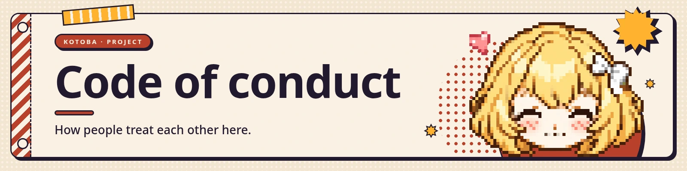

## Our pledge

We as members, contributors, and leaders pledge to make participation in our community a
harassment-free experience for everyone, regardless of age, body size, visible or invisible
disability, ethnicity, sex characteristics, gender identity and expression, level of experience,
education, socio-economic status, nationality, personal appearance, race, caste, colour, religion, or
sexual identity and orientation.

We pledge to act and interact in ways that contribute to an open, welcoming, diverse, inclusive, and
healthy community.

## Our standards

Examples of behaviour that contributes to a positive environment:

- Demonstrating empathy and kindness toward other people
- Being respectful of differing opinions, viewpoints, and experiences
- Giving and gracefully accepting constructive feedback
- Accepting responsibility and apologising to those affected by our mistakes, and learning from them
- Focusing on what is best not just for us as individuals, but for the overall community

Examples of unacceptable behaviour:

- The use of sexualised language or imagery, and sexual attention or advances of any kind
- Trolling, insulting or derogatory comments, and personal or political attacks
- Public or private harassment
- Publishing others' private information, such as a physical or email address, without their explicit
  permission
- Other conduct which could reasonably be considered inappropriate in a professional setting

## Enforcement responsibilities

Project maintainers are responsible for clarifying and enforcing these standards, and will take
appropriate and fair corrective action in response to any behaviour they deem inappropriate,
threatening, offensive, or harmful.

Maintainers have the right and responsibility to remove, edit, or reject comments, commits, code, wiki
edits, issues, and other contributions that are not aligned to this Code of Conduct, and will
communicate reasons for moderation decisions when appropriate.

## Scope

This Code of Conduct applies within all community spaces, and also applies when an individual is
officially representing the community in public spaces.

## Reporting

This project has no private mailbox, and a conduct report should not have to be made in public.

- **To reach the maintainers privately**, use the form at
  [kotoba.rodhnin.com/report](https://kotoba.rodhnin.com/report), or, if you would rather stay on
  GitHub, the [security advisory form](https://github.com/rodhnin/kotoba-companion/security/advisories/new)
  — it is labelled for security because that is what GitHub built it for, but it is the only private
  channel GitHub gives a project. Say at the top that it is a conduct report.
- **If the person you are reporting is a maintainer**, or you would rather it were handled outside
  this project entirely, use [GitHub's own abuse reporting](https://github.com/contact/report-abuse).
  It reaches GitHub staff, not us.

Do not put names or details in a public issue.

Reports will be reviewed and investigated promptly and fairly, and the reporter's privacy and security
will be respected.

## Enforcement guidelines

Maintainers will follow these guidelines in determining the consequences for any action they deem in
violation of this Code of Conduct:

1. **Correction** — a private, written warning, with clarity about why the behaviour was
   inappropriate. A public apology may be requested.
2. **Warning** — a warning with consequences for continued behaviour, including a period of no
   interaction with those involved.
3. **Temporary ban** — a temporary ban from any sort of interaction or public communication with the
   community.
4. **Permanent ban** — a permanent ban from any sort of public interaction within the community.

## Attribution

This Code of Conduct is adapted from the [Contributor Covenant](https://www.contributor-covenant.org),
version 2.1, available at
<https://www.contributor-covenant.org/version/2/1/code_of_conduct.html>, and used under
[CC BY 4.0](https://creativecommons.org/licenses/by/4.0/).

