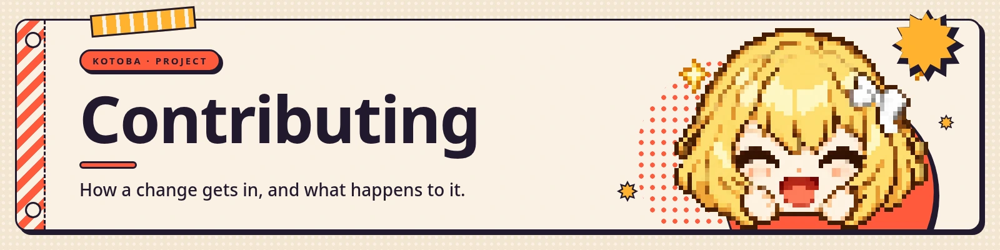

<a href="https://kotoba.rodhnin.com/docs/contributing"></a>

Thanks for wanting to help. Clear bug reports and small, focused pull requests are always welcome.

Longer guides: **[kotoba.rodhnin.com/docs/contributing](https://kotoba.rodhnin.com/docs/contributing)**


## Ways to contribute

- **Personality templates** — new ones in `soul/templates/` (assistant, companion, study, …). No code:
  personality and voice patterns.
- **Model profiles** — a profile for another Live2D Cubism 4 model in `lib/avatar-config.ts`. Kotoba
  ships no model, so every profile is one more avatar that loads without tuning. That file documents
  each field and why it exists.
- **Agent tools** — new tools go in `api/src/kotoba/tools/builtin/` or `api/src/kotoba/tools/action/`,
  which is a registration split, not a safety one: what a tool is allowed to do comes from its
  `TOOLSET` and `RISK`, not from its folder. Follow an existing module for the shape.
- **MCP servers** — teach Kotoba about new servers in `api/src/kotoba/core/mcp/known.py`.
- **Docs** — anything in `docs/` that was unclear when you set Kotoba up.
- **Bug reports** — open an issue with steps to reproduce and what you expected.
- **Tests** — the backend suite is in `api/tests/`. Edge cases and integration tests help.


## Project layout

```
app/              Next.js App Router — "/" redirects to the companion at /app; login gate; setup
components/       React components — room backdrop, Live2D canvas, UI overlay, side panels
lib/              Frontend integration — voice WebSocket, audio, emotion SSE, Live2D controller
lib/__tests__/    and tests/ — the two places `npm test` looks
api/              FastAPI backend — installable package (src-layout)
  src/kotoba/       — the package itself: server.py is the ASGI app
    core/           — loop, context, MCP, sandbox, cron, voice
    tools/          — builtin and action tools (web, memory, files, shell, code, …)
    cli/            — the `kotoba` terminal client
    discord/        — the `kotoba discord` bot: gateway, voice receive, per-account authority
    db/, soul/      — SQLite schema and queries; personality loading and the prompt
    web/            — the compiled frontend; gitignored, so a fresh clone has none
  tests/            — backend test suite
soul/             Personality — default.md and the templates
public/           art/ and scene/ (backdrop and chibi), subagents/, worklets/, the Cubism runtime
assets/           cli/faces/ — the terminal's faces; import-faces.py writes here and into the package
docs/             Self-hosting, the CLI, and the banner art
scripts/          build_web.py, the licence collector, the face-art importer and its two art tools
```

> 
>
> **No Live2D model may be committed.** Models live on the user's machine, in `~/.kotoba/models/`.
> `public/models/` is a legacy fallback and is gitignored — it must stay that way. The good models,
> Live2D's own free samples included, forbid redistribution, so one pushed here would republish
> somebody else's work under this repository's licence.


## Development setup

Two processes, two terminals:

```bash
# Backend, from the repository root
python -m venv .venv && source .venv/bin/activate
pip install -e "api/[dev]"
uvicorn kotoba.server:app --reload --port 8000

# Frontend, in another terminal
npm install
npm run dev          # http://localhost:3000
```

`pip install -e "api/[dev]"` installs the package plus the test tools. `requirements.txt` alone leaves
`kotoba` unimportable and uvicorn fails with `ModuleNotFoundError`.

The backend boots with no API keys — the loop returns a friendly offline reply — so you can work on
the UI and the event pipeline before wiring a model or ElevenLabs. Put real keys in `api/.env` when
you want to test against them.

**The packaged UI** is built by `python scripts/build_web.py`, which needs Node and refuses to run
while a `.env` or `.env.local` sits at the repository root — Next would freeze those values into a
bundle that then ships to everyone. An install with no Node gets that build; a clone with Node keeps
the dev server, because your edits have to show.


## Before you open a pull request

These are the four things CI runs, in the same form:

```bash
pytest api/tests -q                                          # backend suite
npx tsc --noEmit --noUnusedLocals --noUnusedParameters       # the strict typecheck CI uses
npm test                                                     # frontend suite
python scripts/build_web.py                                  # needs Node, and no root .env
```

CodeQL also runs on pushes to `main`, on pull requests targeting it, and weekly, over Python,
TypeScript and the workflows themselves; its findings arrive in the repository's Security tab.

CI runs one more gate that cannot fail on your machine: `KOTOBA_REQUIRE_WEB=1` turns "nobody built
the web UI" from a skip into a failure. It then builds a wheel, installs it into a fresh interpreter,
and imports it with **every directory holding a `node` stripped from the PATH** — proving the
installed app needs no Node of its own. If you touch packaging, expect that job to have an opinion.

A few backend tests fetch and then run somebody else's package — an MCP server off the npm registry, a
container image off a public registry — so they are deselected by default and refuse to run even when
selected. Nothing you clone reaches the internet because you typed `pytest`. When you touch MCP server
installation or the Docker sandbox, ask for them explicitly:

```bash
KOTOBA_ALLOW_NETWORK=1 pytest api/tests -m network
```

To exercise the first-run screens without touching your own install, run `./try-setup.sh`: it points
`kotoba setup` at a throwaway home, so your own database, keystore, settings, memory and personality
files are never opened. It prints the sandbox path and how to delete it.

For any backend change, confirm `GET /health` returns `{"status": "ok"}`.


## Conventions

- **Code, comments and commit messages are English.**
- **Registration is explicit.** A new tool module is registered by being named in
  `tools/registry.py`'s `discover()` (built-in) or `tools/action/__init__.py`'s `ACTION_TOOLS`
  (action). Importing a module is not registering it — a tool left off the list is silently offered
  to nobody.
- **A tool declares its voice patterns** — `ANNOUNCE`, `HEARTBEAT`, `COMPLETE`, `FAIL` — beside
  `SCHEMA` and `execute`. She narrates before a tool runs, again while it is still going, and confirms
  when it lands; a tool without them goes quiet mid-turn. Follow a module in `tools/builtin/`. The one
  exception in the tree is `web_search`, which is deliberately silent and says so in its own docstring.
- **The 14 emotions appear in more places than you expect.** The three that must agree exactly are
  `lib/expressions.ts`, `api/src/kotoba/core/emotions.py` and `api/src/kotoba/soul/prompt.py`. Adding
  one also means the terminal's kaomoji table, both trees of face sprites, and the fallback list in
  `lib/avatar-config.ts`. Which *expression* each emotion plays is a separate, per-model question.
- **Comments earn their place by saying why.** The code already says what. Ten lines is the ceiling
  for any one comment or docstring, and a long docstring is the same thing wearing a different hat.
- **Verify, do not claim.** "Should work" is not acceptable: run it, read the output, then commit.
  Include a test when it is not trivial.
- **No secrets in commits.** Never commit API keys, credentials, or a `.env` with real values. The
  templates to copy are `api/.env.example` and `.env.local.example`.


## Issues and pull requests

The repository has forms for both: **bug report** and **feature request** templates for issues, and a
checklist in the pull request template. Filling them in is the fastest route to a reply.

By taking part you agree to the [Code of Conduct](CODE_OF_CONDUCT.md).

<a href="https://kotoba.rodhnin.com/docs"></a>
