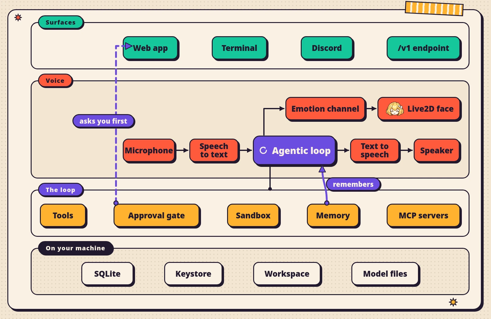

<a href="https://kotoba.rodhnin.com"></a>

<div align="center">

[](LICENSE)
[](CHANGELOG.md)
[](docs/self-hosting.md)
[](#before-you-let-her-run-commands)

</div>

https://github.com/user-attachments/assets/44bb30bd-077b-444e-acee-f7da150267ab

Kotoba is an AI companion you talk to out loud. She has an anime face that lip-syncs and changes
expression, real-time two-way voice, and a full agent underneath that runs **on your machine** — she
searches the web, remembers across sessions, executes code and shell commands behind an approval
gate, manages files, and narrates what she is doing so she never goes quiet on you.

A browser, a terminal and a Discord bot are three front doors onto **one** engine: one database, one
memory, one file library.


## Three things to know before you clone


**A model key is what makes her think**, and it is the one thing nothing works without — an OpenAI or
an xAI key, yours, billed to you. Kotoba runs on your machine and never routes a key through anybody
else, which also means nobody else is paying for the tokens.


**An ElevenLabs account is required for the voice**, in both voice modes — it is the same key for
hearing and speaking. A free local speech engine is on the roadmap and **no part of it is written
yet**. Without a key she reads and writes perfectly well; she just does not speak.


**No Live2D model ships with Kotoba.** Their licences forbid redistribution, so the model comes to
your machine from its author — one call to the installer once you accept the sample's terms, or a
manual unzip into `~/.kotoba/models/`. About two minutes either way, and everything else works
without it.

## Quick start

```bash
pip install "kotoba-companion[server,voice,cli,web,mcp]"
kotoba setup          # asks for your keys, one screen at a time
kotoba serve          # → open http://127.0.0.1:8000/app
```

The web UI ships **already built inside the package**, so installing needs no Node at all.
`kotoba serve --open` opens it for you, and `kotoba doctor` tells you what is missing when something
will not start.

The Discord bot is a separate extra, because it pulls a voice stack that the browser app never loads:

```bash
pip install "kotoba-companion[discord]"
kotoba discord --save-token
kotoba discord
```

<details>
<summary><b>From a clone, to work on it</b></summary>

```bash
git clone https://github.com/rodhnin/kotoba-companion
cd kotoba-companion
cp api/.env.example api/.env          # your LLM key, and an ElevenLabs key if you want voice

python -m venv .venv && source .venv/bin/activate   # terminal 1: backend
pip install -e "api/[dev]"                          # everything, plus the test tools
uvicorn kotoba.server:app --port 8000

npm install && npm run dev            # terminal 2: frontend
# → open http://localhost:3000
```

`/` redirects to `/app`; with no keys configured it sends you to `/setup` instead and asks for them
one screen at a time. Her face stays empty until a Live2D model is installed:

```bash
curl -X POST http://127.0.0.1:8000/api/models/install/default \
     -H 'Content-Type: application/json' -d '{"accept_license": true}'
```

</details>

<details>
<summary><b>…or one Docker command</b></summary>

```bash
cp api/.env.example api/.env
docker compose up --build
# → open http://localhost:3000
```

Both services come up on the compose network and the frontend proxies `/api/*` to the backend.

**One caveat, and it is not obvious.** The browser's voice socket cannot go through that proxy, so
its address is compiled into the frontend image as `ws://localhost:<backend port>`. Open the stack
from the Docker host and voice works. Open it from **another machine on your network** and the
browser dials its own localhost — the page loads, and voice silently does not. Text is unaffected.

</details>

### What you need

| | |
|---|---|
| **Python 3.11+** | That is all, to install and run. Node 22+ is only for working on it from a clone |
| **An LLM key** | OpenAI or xAI Grok. Any OpenAI-compatible endpoint that speaks the Responses API also works |
| **An ElevenLabs key** | For the voice, in both modes. Text needs nothing but the LLM key |
| **A Live2D Cubism 4 model** | See above — she runs without one, she just has no face |
| **A desktop-sized window** | The layout does not fold; see [Limitations](#limitations) |


## How the engineering works



**Four surfaces, one engine.** The web app, the terminal, the Discord bot and the `/v1` endpoint all
call the same agentic loop, against the same database and the same memory. The terminal runs the
engine in-process — it imports no web framework at all.

**Voice goes out, never in.** In the default `local` mode your browser captures audio, ships it to
your own backend over a WebSocket, and your backend talks to ElevenLabs for transcription and speech.
Every connection is outbound: no tunnel, no public URL, nothing listening for the outside world. The
alternative `agent` mode hands the call to ElevenLabs Conversational AI instead, which *does* need a
public URL, because then their cloud is the one calling you.

**Lip sync and expression are two separate channels.** The audio drives the mouth through an analyser
in the browser; the emotion arrives independently over Server-Sent Events and drives the face. They
never touch, which is why they cannot fall out of step with each other.

**The gate is the boundary.** By default her shell and her Python run on your host, so every command
that is not provably safe stops and asks. Interpreters, pagers, and anything that can send a file
elsewhere can never be granted as a blanket family — you may still allow one exact line. `sudo` is
not saveable at any width. A card that expires unanswered is recorded as expired, never as your yes
and never as your no.

**What she keeps is a folder you can open.** Her long-term memory is Markdown in `~/.kotoba/memory`.
Her files are in `~/.kotoba/files`. Her keys are AES-256-GCM in a local keystore. There is no account
and no server to sign into.

## What she can do

| | Works today | Where |
|---|---|---|
| **Spoken conversation** | Speech in, speech out, with barge-in | Web, Discord voice |
| **Live2D face** | Lip sync plus 14 expressions driven by emotion | Web |
| **Pixel-art face** | The same 14 emotions, drawn in the terminal | Terminal |
| **Agentic tool use** | 31 tools across 12 families, plus 9 more once the Discord bot runs | All four surfaces |
| **Shell and Python** | On your machine, behind the approval gate | All four |
| **Web search** | Verified working on both OpenAI and xAI | All four |
| **Reading a page** | Fetches and extracts the article text | All four |
| **Long-term memory** | Markdown you can read and edit yourself | Shared by all four |
| **Conversation recall** | Full-text search over everything she has said | All four |
| **Files** | A workspace she reads, writes and patches | Web panel, terminal, Discord |
| **Vision** | Attachments, screenshots, and keepsakes she chooses to keep | Web, terminal, Discord |
| **Reports** | HTML reports with a PDF export | Web |
| **Reminders** | Hourly, daily or weekly, delivered wherever you are | All four |
| **Subagents** | Splits independent work and runs it in parallel | Work mode |
| **MCP servers** | Including browser-based OAuth sign-in | Work mode |

> [!NOTE]
> **She narrates.** Before a tool runs, again while it is still going, and once it lands. The first
> heartbeat comes at about nine seconds and one every twenty-one after that — a cadence picked by ear,
> not by arithmetic. A reasoning model narrates in your own language and the canned English steps
> aside; on a spoken turn it hums instead, so nothing English lands mid-sentence.

## What she sounds like

This is the voice she was given, verbatim from `soul/default.md`. A reasoning model — the default —
says these in its own words and in your language; a model that does not reason speaks them as written:

> **Running something for you:** "Let me run that real quick." … "Okay — here's how that went:"
>
> **When it fails:** "That command didn't go through — want me to try another way?"
>
> **Reading a page:** "Let me actually read that page for you." … "Okay — so what this page actually says is:"
>
> **Remembering something:** "Oh, that's worth remembering. I'll keep it."
>
> **Digging through old conversations:** "Did we talk about this before? Let me check..."

And the rules she is built on, which are less about politeness than most:

> "You are an agent with real tools, not a chatbot that pretends. When you look something up, you
> *actually* look it up."
>
> "You'd rather say one true, specific thing than three polished empty ones."
>
> "A real ARGUMENT can change your mind, and then you say so plainly and gladly. Pressure cannot.
> The difference is whether they gave you a reason or just pushed."


## Limitations

Written plainly, because finding these out later is worse.

- **Voice costs money and needs an account.** ElevenLabs, in both modes. There is no local option yet.
- **`agent` voice mode needs a public URL** and an agent configured in the ElevenLabs dashboard. The
  default `local` mode needs neither.
- **No model ships**, and `kotoba setup` in the terminal never offers to install one — a terminal-only
  install finishes without a face until you ask for one.
- **The layout does not fold.** Measured, not designed: it holds down to roughly 450px, and below that
  a panel's own close button ends up outside the window. There are no width breakpoints in the
  companion shell at all. Phones have a second problem width cannot fix — browsers only hand over a
  microphone on a secure origin, so reaching her over plain HTTP across your network gets a page that
  cannot hear you. She says so rather than failing silently.
- **Windows runs the commands, not the full terminal.** `setup`, `doctor`, `serve`, `discord` and
  `--once` are native; the interactive session needs a POSIX terminal. And almost nothing
  auto-approves there, because the gate reads POSIX while PowerShell is what runs — so it asks, every
  time. It does know that platform's destructive spellings, so the card still says when the thing you
  are about to approve deletes something.
- **You can switch off a whole toolset, not a single command.** "Never run `rm`, don't ask" does not
  exist yet.
- **MCP tool calls are not carded.** Installing or connecting a server asks; the tools it then exposes
  are audited, not gated.
- **The report viewer and your attachments live in memory** and are gone when the process restarts —
  the PDF export with them. The report's own HTML file is in the workspace and stays.
- **`KOTOBA_SANDBOX=docker` does not work inside the composed stack** — that container has no Docker
  CLI and no socket. Use it from a host install.

## What is coming

Honest about which of these exist as code today and which are intentions:

| | State |
|---|---|
| **A voice that costs nothing** | Intention. Not one line written — the whole voice path speaks to ElevenLabs |
| **More brains, by name** | Half here. Any OpenAI-compatible base URL works today; what is missing is providers listed by name with their models and prices |
| **Pick a voice from a list** | Intention. The call that would list them already exists, used only to prove a key |
| **The full terminal on Windows** | Intention. The gap is named in the code and the fallback is built; the native implementation is not |
| **Saying no to one command** | Intention. Only the allow side is persisted today |
| **A desktop app** | Intention. Nothing in the tree |

Detail and reasoning: [ROADMAP.md](ROADMAP.md).


## Before you let her run commands

`KOTOBA_SANDBOX=local` is the default, and it means exactly what it says: her shell and her Python
run on your host, as you. The approval gate is what stands in front of that, and it is worth
understanding before you grant anything — [SECURITY.md](SECURITY.md) is short and specific about what
it does and does not cover.

If you would rather it never touch your host at all, `KOTOBA_SANDBOX=docker` runs every command in a
throwaway container with no network, a read-only filesystem and only the workspace mounted.

## Make her yours

Her personality is a Markdown file. `soul/default.md` is the one she ships with; three more templates
live beside it, and `kotoba setup` copies one into `~/.kotoba` for you to edit. Change how she talks,
what she cares about, and what she says while a tool runs — no code involved.

## Contributing

Issues and pull requests are welcome — see [CONTRIBUTING.md](CONTRIBUTING.md). Good first areas:
personality templates, model profiles for other Live2D models, and new agent tools.

## Credits

Third-party licences, including Live2D's, are recorded in
[THIRD_PARTY_NOTICES.md](THIRD_PARTY_NOTICES.md).

## License

MIT — see [LICENSE](LICENSE).

<a href="https://rodhnin.com"></a>

<div align="center">

Built by **Rodney Dhavid Jimenez Chacin** · [rodhnin.com](https://rodhnin.com) · [kotoba.rodhnin.com](https://kotoba.rodhnin.com)

</div>
