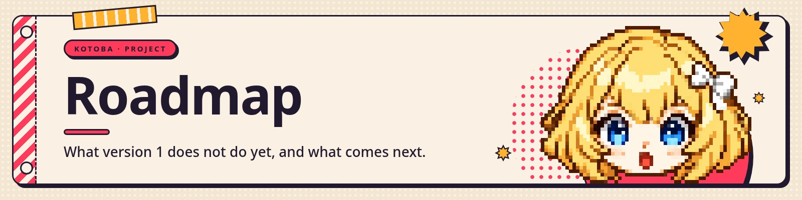

Version 0.10 is the first release: she runs on your machine, talks, and does things. This page is the
honest list of what she cannot do yet — small, concrete gaps, not a wish list.

Dates are not promised. The order below is roughly the order of work.

Full detail and progress: **[kotoba.rodhnin.com/docs/roadmap](https://kotoba.rodhnin.com/docs/roadmap)**

## In this release

| | What this release gives you |
|---|---|
| **Brains** | OpenAI and xAI, chosen at setup and switchable later |
| **Voice** | ElevenLabs, in and out, with two engines to pick between |
| **Avatar** | a Live2D model of your own; the browser's first-run screen fetches the free sample for you |
| **Surfaces** | a browser app, a full terminal, and a Discord bot that reads and talks |
| **Tools** | shell, code, files, web, memory, vision, reports, skills, cron, subagents, MCP servers |
| **Windows** | `setup`, `doctor`, `serve`, `discord` and `--once` run natively |

## Next

**Pick a voice from a list.** Today you paste an ElevenLabs voice ID into Settings, which means
leaving the app to go and find one. It should be a dropdown of the voices your key can actually use.

**More brains, by name.** Any OpenAI-compatible endpoint already works today — Settings takes a base
URL and a model name typed by hand. What is missing is the other half: providers listed by name, with
their models and what each one costs, the way OpenAI and xAI are. Adding one means editing Python in
three places.

**A voice that costs nothing.** ElevenLabs is required today, and that is the single biggest
thing standing between Kotoba and someone who just wants to try her. A local speech engine, running
on your own machine, removes it.

**The full terminal on Windows.** The commands run there now, but the interactive session does not —
it needs a POSIX terminal. Making it native is a piece of work, not a patch.

**Saying no to one command.** You can already switch a whole toolset off in Settings — turn off the
terminal and `shell` is never offered and never asked about. What you cannot do is the narrow version:
"never run `rm`, don't ask", while keeping the rest of the toolset.

**A desktop app.** One window, no browser tab, no terminal.

## Not planned

Some things are deliberate absences, so nobody waits for them:

- **A hosted version you sign into.** Kotoba is self-hosted. Your keys and your conversations stay on
  your machine.
- **Shipping a Live2D model in the repository.** Models belong to their authors. The installer fetches
  one onto your machine instead.
- **Telemetry.** Not now, not later.

## Asking for something

Open an issue with the **feature request** template. What helps most is the shape of the thing you
were trying to do when you hit the wall — not the feature you designed to fix it.

