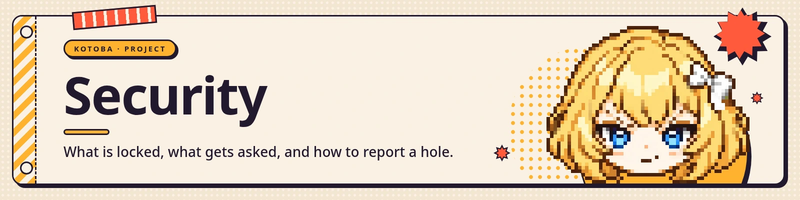

<a href="https://kotoba.rodhnin.com/docs/security"></a>

Kotoba runs on your machine, holds your API keys, and can execute commands. This page says exactly
what protects you, and — just as carefully — what does not.

Full detail: **[kotoba.rodhnin.com/docs/security](https://kotoba.rodhnin.com/docs/security)**


## Reporting a vulnerability

**Do not open a public issue for a security problem.** The security contact for this project is the
form at **[kotoba.rodhnin.com/report](https://kotoba.rodhnin.com/report)**. If you would rather stay
on GitHub, a [security advisory](https://github.com/rodhnin/kotoba-companion/security/advisories/new)
is private until a fix ships and keeps the report attached to the code.

Say what you did, what happened, and what you expected. A proof of concept helps and is not required.

### What happens next

| Stage | What to expect |
|---|---|
| First reply | within **14 days**, saying whether it reproduces — usually much sooner |
| While it is open | you are told what is being done, and asked before anything is published |
| Disclosure | when the fix ships, or **90 days** after the report, whichever comes first |
| Where | as a published advisory on the repository, and a CVE where one is warranted |
| Credit | your name in the advisory, or none at all — your choice |

The 90 days is a ceiling, not a target. If you need longer, say so and it will be honoured; if the
problem is already public, disclosure is immediate. There is no bug bounty: this is a small project
and there is no money in it.

**Supported version: the latest release.** Older versions get no backports — the fix is the upgrade.

### What is in scope

Kotoba running as documented, on a machine you control: the backend, the terminal, the web UI, the
Discord bot, and the packaged wheel.

**Out of scope**, because they are the product working as designed and documented:

- Anything she does after **you approve** an approval card. The card is the boundary.
- Everything on this page's *what does not protect you* list.
- Ordinary commands under `KOTOBA_SANDBOX=docker`, where the container is the boundary.
- Exposing the backend to a network without setting a gate password.
- Third-party services she talks to — report those to the service.

### Testing safely

Test against **your own install**. Do not test against anyone else's machine, and do not use a
vulnerability to reach data that is not yours. Report made in good faith under those terms will be
treated as help, not as an attack, and no legal action will be sought over it.


## What protects you

**The web gate.** Set `KOTOBA_WEB_PASSWORD` and every `/api/*` route requires it — as a `Bearer`
header or a `?token=` parameter. `KOTOBA_GATE_PASSWORD` is an accepted alias, so one
value gates both halves. Public without it: `/health`, the gate routes themselves, the OAuth callback,
and the login page with the frontend's static assets — `/app` and `/setup` cost a signed session.

**The model endpoint.** `/v1/chat/completions` accepts **either** credential: its own bearer
`KOTOBA_API_KEY`, or the gate password. Setting the gate password closes both halves at once.

> 
>
> **With neither variable set, both are open.** That is fine on a laptop bound to localhost. It is not
> fine on anything reachable from a network. Set a password before you expose a port.

**The approval gate.** With `KOTOBA_SANDBOX=local`, every shell command and every snippet of Python
stops and asks. You answer; nothing runs before you do. Reading is free — a `cat` inside her own
working folder does not interrupt you. Two things this gate does NOT cover, said plainly: writing a
file inside her own library is her ordinary work and draws no card, and a command you approve runs
with your permissions — the jail holds her file tools, not what you said yes to.

**Who she answers to on Discord.** `KOTOBA_DISCORD_OWNER_ID` is the single setting naming the account
that is her person, read from the environment and never inferred from anything anyone types. Unset,
nobody is: the tools reserved to her are withheld from everyone and refused by name if reached anyway,
and a card for a command on your machine has nobody left who may press it, so it times out denied.

**Three tiers, on Discord.**

- **Her person** — the account id in `KOTOBA_DISCORD_OWNER_ID`: her whole toolset apart from the
  four server-shaping tools, which want Discord's Administrator bit from her too, and the two that
  draw a card in a browser, which Discord has nowhere to paint; and the only one
  who may approve a command that runs on your machine or have her attach a file from your library.
- **A server administrator** — Discord's own Administrator bit, computed by the library from the role
  bits the gateway sent: adds reading the server's layout, and planning, making and applying changes.
- **Anyone else** — the web and skills tools, the Discord tools that carry nothing of yours — history,
  people, voice, and a note about themselves, which `discord_remember_person` restricts to the person
  speaking — and a few companion odds and ends. It is an allow-list: anything unlisted is withheld.

**Withholding a tool's schema is not the only refusal.** `excluded_tools` decides which schemas a turn
is offered, and the dispatcher refuses an excluded name outright — but the model keeps names it saw
earlier in the same turn, so every restricted **Discord** tool asks again inside `execute`:
`discord_act`, `discord_plan`, `discord_apply_plan` and `discord_guild_read` want the Administrator
bit, `discord_send_file` and `view_capture` want her person, and each answers in a sentence when it is not there. Your
host tools are not offered to a guest at all, and anything that runs on your machine is gated a
second time by a card only her person may press. The schema list is the hint. The guard inside the
tool is the door.

**The Docker sandbox.** With `KOTOBA_SANDBOX=docker` her commands run in a container started with
`--network none --read-only --cap-drop ALL`, with only her working directory mounted. That mount is
your real folder, not a copy: deleting a file inside the container deletes it on your disk, and an
ordinary command there is not carded.

**Keys at rest.** API keys you save are encrypted with AES-GCM in the keystore, never written to the
settings file, never logged, and never handed back to a caller or to the model.

**The audit trail.** Every tool call she makes that *changes* something — a write, an execution, a
call out to a service on your behalf — is recorded with what was asked, what actually happened, and
who approved it where anyone was asked at all. A file written inside her library says so honestly:
`none — the loop ran it, nobody was asked`. Reading is not recorded: see below.


## What does not protect you

A security page that only lists its wins is not a security page.

**The code pre-screen is a speed bump, not a wall.** Before an approval card is even drawn, submitted
code is scanned for obviously dangerous shapes. It matches the plain forms, and it matches an aliased
`os` — `import os as o` is flagged. It does **not** catch every alias (`import shutil as sh` gets
through), nor every way an HTTP client can be built.
It is there to catch accidents, and it will not stop anyone deliberately hiding something. **The
approval card is the real control**, which is why nothing runs without one.

**"Auto-safe" is narrower than it sounds.** The auto-approved list is reads plus `mkdir`. Under
`KOTOBA_SANDBOX=docker` an ordinary command runs without a card — the container is the boundary there,
not the card — though a shape the pre-screen calls dangerous is still stopped and still asked. Run
`local` if you want to be asked about everything. Under `none` the question never arises: `shell` and
`execute_code` are not offered at all, which makes it the strictest of the three, not the loosest.

**A channel is an audience.** What she writes in a Discord channel — her answer, whatever a tool put
into it, the body of an approval card, a file she attaches — is read by everyone with access to that
channel. So asking her to read a file while she is in a server is asking her to publish it there, and
the card for anything that runs on your machine says as much on its face. The one thing she will not
take in a channel is a key or a password: that she refuses outright, and asks for in the terminal
instead.

**Reading the web is not audited.** Searching, fetching a page and opening a link are read-risk tools,
so they do not appear in the audit trail. What she read is in the conversation, not in the log.

**Windows keeps almost no grants.** Nothing derived from a shell line persists there, and neither
does a single exact line: every command asks again, every time. The command analysis is written for
POSIX shells and Windows runs PowerShell, so rather than guess it keeps asking. The one grant that does
survive is a whole named family that is not a shell command at all — "always allow execute_code".

**Page reads can leave your machine.** `pip install kotoba-companion[web]` installs the local
extractor; without it every page read falls back to a public reader service, which means the URLs she
opens are seen by a third party. With it she still falls back when the direct fetch fails or the site
serves a block page. `kotoba doctor` says so when the extra is missing.


## Where your data lives

| What | Where |
|---|---|
| Conversations and the audit trail | `~/.kotoba/kotoba.db` — or `api/kotoba.db` in a clone that already has one sitting there |
| Settings | `~/.kotoba/settings.yaml`, a plain file you can read |
| Saved keys | encrypted inside the database; the key that decrypts them is `~/.kotoba/.keystore_key` |
| Files she works with | `~/.kotoba/files` |
| Logs | `~/.kotoba/cli.log` |

Read the audit trail yourself:

```bash
sqlite3 ~/.kotoba/kotoba.db "select * from audit_log order by created_at desc limit 20"
```

Nothing in Kotoba sends telemetry. What leaves your machine is what you ask for: the model provider,
ElevenLabs for voice, and whatever tool you tell her to use.

<a href="https://kotoba.rodhnin.com/docs"></a>
