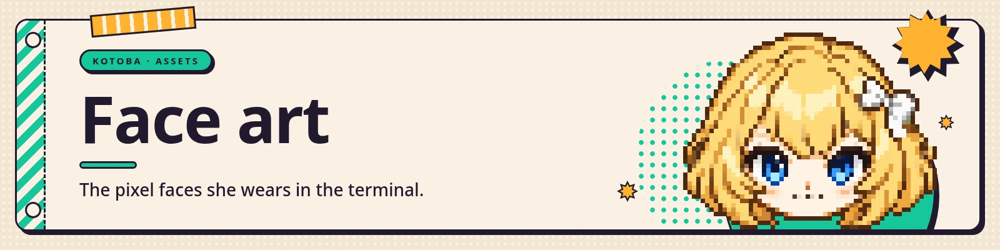

<a href="https://kotoba.rodhnin.com/docs"></a>

Her face for the terminal. One sprite per emotion, at the resolution a terminal cell can actually
hold.

```
faces/<emotion>.png            the sprite, 58-60 x 45-48 px, transparent
faces/<emotion>-outlined.png   the same sprite ringed in one pixel of ink (#52351e), 2 px larger each way
```

`<emotion>` is one of the fourteen names the rest of the system already uses. The filenames are the
lookup key, so they are not ours to rename: `neutral, happy, excited, sad, crying, angry, surprised,
embarrassed, thinking, sleepy, affectionate, confused, scared, determined`.


## There are two trees and both must move

The sprites live twice: here, and again under `api/src/kotoba/data/cli/faces/`, which is the copy a
wheel ships. The renderer prefers **this** tree inside a checkout and falls back to the packaged one.

It used to prefer the package even in a checkout, and a batch written only into `assets/` then changed
nothing on screen: the importer printed `ok` fourteen times, the terminal kept drawing last month's
face, and the fix was somebody copying files across by hand. Inverting the order moved that failure
rather than removing it — a batch written only into `assets/` now looks right in the checkout and
ships a stale face in the wheel. **Write both trees, always.**

`import-faces.py --apply` writes both from the same bytes and ends by comparing them, exiting
non-zero if they ever disagree. `import-faces.py --check` runs only that comparison. The test suite
asserts the same thing on every checkout run, with its own copy of the comparison rather than by
calling the script — so if you change what "agree" means, change it in both.


## Which file to draw

Two decisions, and they are independent of each other.

**Which sprite** comes from the terminal's detected background, on every tier:

| detected background | file |
|---|---|
| light | `faces/<emotion>-outlined.png` |
| dark, or unknown | `faces/<emotion>.png` |

The outlined variant exists because her skin and a pale terminal are nearly the same colour: without a
ring, her chin dissolves into the background and she reads as floating hair. The detection is a real
question asked of the terminal, so it has three answers, not two — and a pale terminal that does not
answer counts as unknown and gets no ring. That is the one case the outline was drawn for and does not
reach; `KOTOBA_FORCE_BACKGROUND` is the way out of it.

**How it is drawn** is the tier: sixel where the terminal has it, half-blocks otherwise. Either way
the sprite is upscaled by a whole-number factor with NEAREST and never resampled.

## Two things the renderer must get right

**Scale by the head, not by the canvas.** The canvas is deliberately not uniform — six different
sizes across the fourteen, because a sprite carrying a floating mark is bigger than the rest to hold
it:

| canvas | emotions |
|---|---|
| 58x45 | affectionate, angry, determined, embarrassed, happy, neutral, scared |
| 58x46 | sad, sleepy |
| 58x48 | thinking (tallest — raised hand and thought dot) |
| 59x45 | confused, crying |
| 60x45 | surprised |
| 60x46 | excited |

Fitting those to a fixed *width* shrinks her head on exactly those frames, so she appears to change
size when she thinks. Anchor on the head instead — and do not "fix" the sizes back to one number. The
same trap catches review tools: the preview script once sized its grid from `neutral` alone and
clipped the widest faces on both sides. It sizes from the widest and the tallest of the set now.

**Downscale with NEAREST.** Any smoothing filter turns this back into the mush it was drawn to avoid —
measured, not assumed.

`thinking` measures largest of the fourteen, and must not be "matched" down for it: what the metric
sees is the raised hand merging into the head blob, and the extra canvas is the floating marks — the
same pattern as `confused`'s "?". Shrinking it would make the one thing that matters — the head —
smaller than `neutral`'s.


## Regenerate all fourteen together

`neutral` was once left behind at 56x47 while the other thirteen moved, and because it is the RESTING
face a 3.6% difference read as her leaning in on every reaction and settling back. All fourteen come
from one batch and one reference. Redo the set, never a single emotion.

```bash
scripts/snap-pixelart.py in.png out.png [--outline] [--grid N]   # one file: find the grid, snap, key the bg
scripts/import-faces.py <folder> --apply [--pattern GLOB] [--grid N]
scripts/import-faces.py --check                                  # just compare the trees
scripts/faces-preview.py [--blocks]                              # eyeball the fourteen
```

`import-faces.py` looks for `kotobapixel-*.png` unless `--pattern` says otherwise, and exits with
`nothing matched` rather than guessing.

`snap-pixelart.py` exists because image models draw "pixel art" at 1024 px with soft edges — the
blocks are there, but each one is a fuzzy patch fifteen pixels across. It finds the block period by
autocorrelating the edge profile, then takes one colour per block. Resizing that image any other way
destroys it.

> 
>
> **If a source render has been rescaled, pass `--grid` with its ORIGINAL block period.** Auto-detect
> reads a rescaled source's period as one pixel off and quietly emits a sprite of a different size —
> and the tool prints `ok` while the art regresses. Forcing the true period on a batch whose renders
> are untouched changes nothing, so `--grid` is safe to pass when you are unsure.

<a href="https://kotoba.rodhnin.com/docs"></a>
