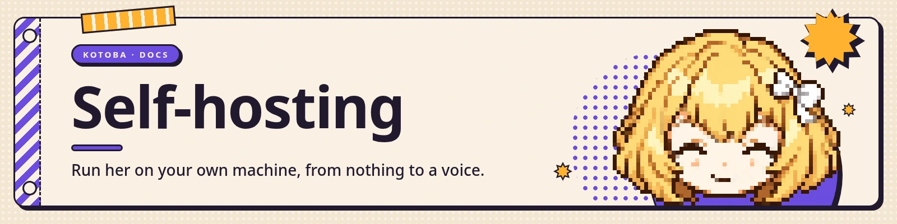

<a href="https://kotoba.rodhnin.com/docs/self-hosting"></a>

Installed from PyPI, Kotoba is one service: a FastAPI backend that also serves the web UI it carries.
From a clone it is two, a Next.js dev server in front of that backend. Both live on your machine, and
everything
they need from outside — the model, ElevenLabs speech-to-text and text-to-speech — is reached
**outbound**. Nothing has to reach *in*, so the default setup needs no tunnel, no public URL and no
ElevenLabs dashboard agent.

Full guide: **[kotoba.rodhnin.com/docs/self-hosting](https://kotoba.rodhnin.com/docs/self-hosting)**

> 
>
> **Read [Code execution](#code-execution) before your first conversation.** By default
> she runs shell commands and Python on this machine. That is deliberate, and it is gated by an
> approval card you answer — but you should know what you are agreeing to before you agree to it.


## What you need

- **Python 3.11 or newer.** That is the floor in `api/pyproject.toml`, and `kotoba doctor` enforces
  the same number. Older versions do not install. The `Dockerfile` builds on 3.14; that is the image's
  choice of a supported version, not a second floor.
- **Node 22 or newer — only if you are working on the frontend.** A `pip install` carries the web UI
  already built. `.nvmrc` pins the version, so `nvm use` picks it up and CI reads the same file;
  `Dockerfile.web` builds on `node:22-slim` to match.
- **A model key** — OpenAI by default, and `gpt-5.6-luna` is the one to start with: it is the
  cheapest model on the list, and it holds as much conversation as the most expensive one, which is what a companion is made
  of. [Get one](https://platform.openai.com/api-keys). xAI Grok and any OpenAI-compatible endpoint
  also work — pick yours in **Settings → Brain**, or during `kotoba setup`.
- **An ElevenLabs API key — required for the voice**, in both modes: it is used outbound for realtime
  speech-to-text and text-to-speech. There is no free or local speech engine yet; one is on the
  [roadmap](../ROADMAP.md). [Get one](https://elevenlabs.io). Without it she still reads and writes —
  she just does not speak.
- **A Live2D Cubism 4 model** — none ships with Kotoba, because their licences forbid redistribution.
  The backend can fetch Live2D's free sample onto your machine for you, or you can install one by
  hand. Everything except the face works without one.
- **(Optional) The browser tools.** They are an MCP server, so they need the `mcp` extra, Node on
  your PATH, and the server connected once in Settings — they are not on by default. After that she
  drives a headless browser of her own; point `KOTOBA_BROWSER_CDP` at your real, logged-in browser's
  debugging endpoint to get past anti-bot walls instead. Either way the browser starts **the first
  time she actually uses it**, not at startup.


## 1. Install

The short way, which needs no Node and no clone:

```bash
pip install "kotoba-companion[server,voice,cli,web,mcp]"
kotoba setup     # pick a provider, hand over a key
kotoba serve     # backend and web UI together
```

The contributor way, from a clone:

```bash
git clone https://github.com/rodhnin/kotoba-companion
cd kotoba-companion
cp api/.env.example api/.env

python -m venv .venv && source .venv/bin/activate
pip install -e "api/[server,voice,mcp,web,cli]"
```

Two lines in `api/.env` are all the default path needs:

```bash
OPENAI_API_KEY=sk-...       # the loop's model, web search and emotion extraction
ELEVENLABS_API_KEY=el_...   # outbound speech-to-text and text-to-speech
```

`DATABASE_URL` and `SOUL_PATH` come pre-filled and are already the defaults the server falls back to.
`KOTOBA_API_KEY` ships commented out: it is the bearer for `/v1/chat/completions`, which only the
optional ElevenLabs `agent` voice mode uses.

**You do not need `.env.local` at all** on the default path, which is why it is not copied above. It
exists for the split-origin case: `NEXT_PUBLIC_API_URL` tells the browser to call the backend on a
*different* origin, and `KOTOBA_BACKEND_URL` tells the Next server where to find it (it defaults to
`http://127.0.0.1:8000`). Left unset, the frontend serves everything from its own origin and Next
rewrites `/api/*` server-side: no CORS, no cross-site cookies, one URL.

Creating it has a cost worth knowing: `NEXT_PUBLIC_*` values are frozen into the compiled bundle, so
`scripts/build_web.py` refuses to run while that file exists rather than baking your address into
everybody's copy.

> 
>
> **Install the `web` extra.** Without it, reading a web page falls back to a public reader service,
> so the URLs she opens are seen by a third party. `kotoba doctor` says so when it happens.


## 2. Give her a face

**No Live2D model ships with Kotoba.** The licences of the good ones — Live2D's own free samples
included — forbid redistribution, so the repository carries the expression contract and the model
arrives on your machine, from its author. Without one the app still runs and she still talks; the
avatar card says no model is installed and names the folder to put one in.

Models live in **`~/.kotoba/models/`**, one folder per model — outside the repository, because that is
the only place writable after an install. `KOTOBA_MODELS_DIR` moves them.

The browser's first-run screen offers to fetch the sample for you. **`kotoba setup` does not** — a
terminal-only install finishes without a face, and this step is how you give her one.

### Let the backend install it

It fetches Live2D's free **niziiro-mao** sample, from Live2D, to your machine, and only after you say
you accept [their terms for the sample data](https://www.live2d.com/en/learn/sample/model-terms/):

```bash
curl -X POST http://127.0.0.1:8000/api/models/install/default \
     -H 'Content-Type: application/json' -d '{"accept_license": true}'
```

A `.zip` you already have goes in the same way — the body IS the archive, so it streams to disk
instead of being held in memory:

```bash
curl -X POST http://127.0.0.1:8000/api/models/install/upload --data-binary @my-model.zip
```

Add `-H "Authorization: Bearer $KOTOBA_WEB_PASSWORD"` when a password is set.

Either one answers with the folder it created and leaves her wearing it. Both refuse an archive over
200 MB, one that unpacks to more than 300 MB or holds more than 4000 entries, one that names a file
outside the folder it installs into, one carrying a link instead of a file, and one with no
`.model3.json` in it; anything a browser would run is left out rather than written.
The archive is unpacked to one side and moved into place only once all of it has passed, so a failure
leaves no half-installed model.

### Or by hand

Download the sample from [Live2D's sample page](https://www.live2d.com/en/learn/sample/). The archive
carries no folder of its own, so give it one — that folder is the name the model answers to:

```bash
mkdir -p ~/.kotoba/models/mao_pro
unzip mao_en.zip -d ~/.kotoba/models/mao_pro
```

The entry file lands at `~/.kotoba/models/mao_pro/runtime/mao_pro.model3.json`, which is where Kotoba
looks. Keep the licence file beside it. The default profile hides the hat and the wand and frames her to the
face, which is why she looks nothing like the sample's promotional art.

Any other Cubism 4 model works: drop its folder in beside that one and **reload the page** — no
rebuild, no environment variable. With several installed, pick one under **Settings → Personality**.
With exactly one, that one is used. A model nobody wrote a profile for still loads: Kotoba reads what
the model declares about itself and completes the map. To tune the framing or remap an emotion, see
[`lib/avatar-config.ts`](../lib/avatar-config.ts).

Kotoba serves those files itself, read-only, under `/api/models/raw/…`, and serves nothing from that
folder but the file types Cubism asks for — a stray `.html` or `.js` in a downloaded model would
otherwise run on the app's own origin.


## 3. Run it

From an install, one command runs both:

```bash
kotoba serve --open
```

From a clone, two processes in two terminals, so your frontend edits show:

```bash
uvicorn kotoba.server:app --reload --port 8000     # backend
npm install && npm run dev                          # frontend
```

**Building the packaged UI** is `python scripts/build_web.py`, which needs Node and refuses while a
root `.env` exists, for the reason given in step 1. Afterwards `kotoba serve` still prefers the dev
server whenever npm is available, since your edits have to show; the packaged copy is what an install
without Node gets.

> 
>
> **Containers:** `docker compose up --build` brings both services up. `api/.env` must exist first —
> compose reads it and fails outright if it is missing. The ports are baked into the frontend image at
> build time, so pass `--build` whenever you change `KOTOBA_BACKEND_PORT` or `KOTOBA_WEB_PORT`.

## 4. Talk to her

Open `http://localhost:3000` — it redirects to `/app` — then press **Call Kotoba** and allow the
microphone. That is the whole flow; there is no agent to register anywhere.

If you skipped the keys, `/app` sends you to `/setup` instead: the same questions, one screen at a
time. `kotoba setup` is the terminal version and both write to the same place.

## 5. Verify

```bash
curl http://localhost:8000/health
# → {"status":"ok"}
```

If `/health` answers but she never speaks, check the backend log for an ElevenLabs auth error and
confirm the browser actually granted microphone access.


## Changing her name, her voice and her language

> 
>
> **Her name and her language are seeded from `soul/default.md` on the very first boot and never read
> from it again.** Renaming her in that file afterwards does nothing. Change them in
> **Settings → Personality**, or from the terminal.

`voice_id` and `avatar_model` are in between: the file fills them only while the stored value is
empty, so once you have picked a voice or a model, the file stops overriding your choice — that is
deliberate, or every restart would quietly undo it.

Everything else in that file — her personality, how she addresses you, her emotional rules, her tool
voice patterns, her quirks — is re-read from the file **on every start**. Edit those and restart the
backend; a running process will not pick them up mid-conversation.

## Code execution

Kotoba runs **locally**: it is your machine and your agent, not a service acting on your behalf. The
execution backend is `KOTOBA_SANDBOX`:

- **`local`** (default) — a child process jailed to her working directory, with a **scrubbed
  environment** so no API key reaches the code she runs, plus timeouts and output caps. That working
  directory is her file library (`~/.kotoba/files`) unless `KOTOBA_WORKSPACE_DIR` points at a real
  project folder; throwaway files go to `~/.kotoba/tmp`, exposed as `TMPDIR`.
- **`docker`** — the local Docker daemon, for opt-in isolation. The container starts with
  `--network none --read-only --cap-drop ALL` and only her working directory mounted.
- **`none`** — no tool of hers starts a process here: `shell` and `execute_code` are not offered, and
  file search falls back to a pure-Python walk (literal matches, no regex). Note what it does *not*
  cover: MCP stdio servers and the browser are installed and approved separately, and they still
  launch when you use them.

**Approval before running.** On `local`, every command beyond a simple read stops and asks. Choose
**always allow** to whitelist that command family; revoke it under **Settings → Security → Allowed
commands**, or with `/approvals` in the terminal. Destructive patterns always require an explicit
yes and can never be whitelisted — `rm -rf`, `sudo`, `curl | sh` here, and `rd /s /q`,
`Remove-Item -Recurse`, `format`, `reg delete`, `vssadmin delete` and `iwr | iex` on Windows.

On `docker` the card is not the boundary — the container is — so ordinary commands run without
asking. On `none` nothing runs at all, with or without a card. [SECURITY.md](../SECURITY.md) spells
out exactly what that means.

**Audit log.** Every write, exec and network tool call is recorded in the local database with who
authorized it and what happened. No API exposes it; read it yourself:

```bash
sqlite3 ~/.kotoba/kotoba.db "select * from audit_log order by created_at desc limit 20"
```

A database sitting beside the package wins over the home, so an older checkout keeps using
`api/kotoba.db` if that file is already there. A fresh clone uses the home like everything else.

**Her files** are saved to a real folder — `~/.kotoba/files`, override with `KOTOBA_FILES_DIR` — so the
Files panel shows them across restarts and you can open the folder yourself. Text is capped at ~200 KB
per file, images at ~12 MB. **Nothing is deleted on a file count**: in the default setup that folder
is also her working directory, so its files are your only originals. The newest-500 cap applies only
when `KOTOBA_WORKSPACE_DIR` points elsewhere, which makes the library a mirror of copies.


## If you put Kotoba on a public URL

This guide covers the local install, which is what the project is built around. Exposing the backend
to the internet is a strictly bigger setup and the full procedure lives at
[kotoba.rodhnin.com/docs/self-hosting](https://kotoba.rodhnin.com/docs/self-hosting). Two things are
worth stating here anyway, because getting them wrong is not recoverable by reading later:

- **Set `KOTOBA_WEB_PASSWORD` before you expose anything.** Without it every `/api/*` route — settings,
  files, MCP connect, stored keys, and the gate that authorizes execution on your machine — is open to
  anyone who finds the URL — and so is `/v1/chat/completions`, which is open only while **neither**
  `KOTOBA_API_KEY` nor the gate password is set. Setting the gate password closes both. When you run
  the Next frontend as its own process it needs that same value in its own environment; a real
  environment variable is the better way to give it one, since a `.env.local` blocks the packaged
  build.
- **Put TLS in front of it.** On plain HTTP the gate password and everything after it travel in the
  clear. Fine for `localhost`, acceptable on a LAN you trust, not acceptable on the internet.

### Plain HTTP and login loops

The gate's session cookie is marked `Secure` only when the request came in over HTTPS. A browser
refuses a `Secure` cookie on an `http://` page, which produces the worst possible symptom: the
password is accepted, the redirect goes through, and you land back on the login screen.

You do not have to configure anything for the common cases — Kotoba reads `X-Forwarded-Proto` (or
`X-Forwarded-Scheme`) and falls back to the request's own scheme. Cloudflare, Vercel, nginx, Caddy and
Traefik all send it. **If you run your own reverse proxy, make it set `X-Forwarded-Proto` to the
scheme the browser used** — nginx needs `proxy_set_header X-Forwarded-Proto $scheme;` written out.


## Troubleshooting

| Symptom | Likely cause |
|---|---|
| Her card says no model is installed | Nothing in `~/.kotoba/models/` — the notice names the exact folder. See [step 2](#2-give-her-a-face) |
| Her card shows a load error instead of a face | A model is installed but incomplete: check the browser's Network tab for the file that 404s. A model whose entry file is more than two folders deep is not found at all |
| You renamed her in `soul/default.md` and nothing changed | That file seeds those fields once. Change them in Settings → Personality |
| Call connects but she never speaks | `ELEVENLABS_API_KEY` missing or rejected — the backend log shows the auth error |
| No transcript appears when you talk | The browser never got the microphone; check the site's permission and the console |
| Voice sounds flat, `[tags]` never performed | The `fast` engine is selected — switch to `expressive` in Settings → Personality |
| Everything 401s after login | The backend and the frontend hold different gate passwords; both processes need the same value |
| Login accepts the password and returns to the login screen | The browser dropped the session cookie — see [Plain HTTP and login loops](#plain-http-and-login-loops) |
| `docker compose up` fails immediately | `api/.env` does not exist. Compose reads it and will not start without it |
| An MCP server will not connect | Read the error the Settings panel shows. A missing `~/.kotoba/mcp.yaml` is not the cause — with no file she simply has no servers configured. OAuth servers additionally need `KOTOBA_PUBLIC_URL` |

## Beyond this guide

How the local voice pipeline is wired, the ElevenLabs `agent` voice mode, deploying the two services
apart, multi-provider configuration, MCP servers, custom tool plugins, and which settings are
import-time rather than live — all of it lives at
[kotoba.rodhnin.com/docs](https://kotoba.rodhnin.com/docs).

`api/.env.example` and `.env.local.example` document the variables you are most likely to want. They
are not exhaustive: `KOTOBA_HOME` relocates what Kotoba writes — in a clone the database stays with
the checkout — and the CLI reads several variables of its own. The complete list is on the
documentation site.

<a href="https://kotoba.rodhnin.com/docs"></a>
